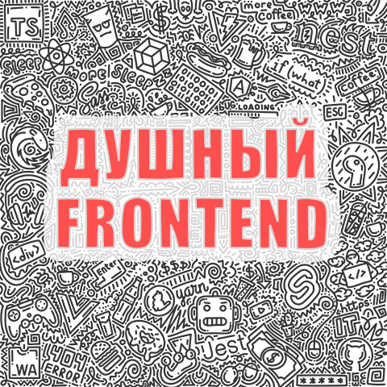

# Podcasts

> **For non-Russian speakers:**
> This space is a unified project for podcasts hosted by Fedor Usakov. All podcasts are in Russian, so this space is also in Russian.
> Licensing information is listed at the bottom of the page.
> If you have any questions, feel free to [write to me](mailto:podcast@usakov.dev).

---

## Душный Frontend

Это подкаст, в котором фронтендеры рассуждают о том, что совсем не обязательно попадает в их стек. Мы поговорим о фреймворках и инструментах, обсудим подходы и практики, пригласим интересных гостей.

### Эпизоды

#### Сезон первый, технический

- 1.1.0 – Про фреймворки и их будущее ([@progikusok](https://github.com/progikusok), [@webgangster0](https://github.com/webgangster0))
- 1.1.1 – _TBA_

### Слушать на популярных платформах

|                                                                 |                                                                                   |                                      |
| --------------------------------------------------------------: | :-------------------------------------------------------------------------------: | :----------------------------------- |
| [Spotify](https://open.spotify.com/show/3nrhcBHhX1QGcjFFdxkyHs) | [Apple Podcasts](https://podcasts.apple.com/podcast/душный-frontend/id1672181806) | Google Podcasts                      |
|                       [Deezer](https://deezer.com/show/5743467) |                                   Yandex Music                                    | [Anchor](https://anchor.fm/frontend) |

---

## Licenses

This work is licensed under Attribution-NonCommercial-NoDerivs (CC BY-NC-ND).

Background music is separately licensed under proprietary license. [Email me](mailto:podcast@usakov.dev?subject=Licensing%20documents) for supporting documents.

